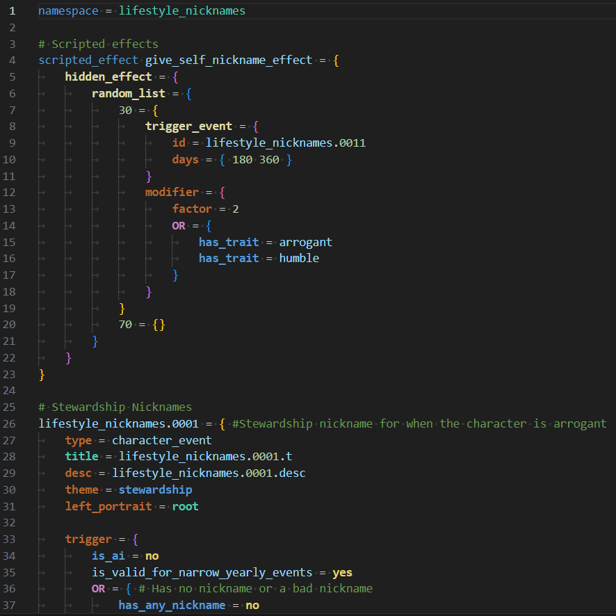
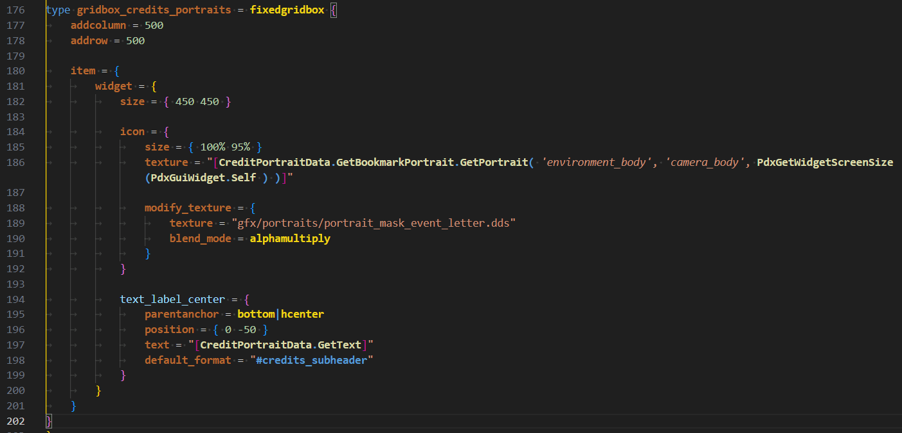
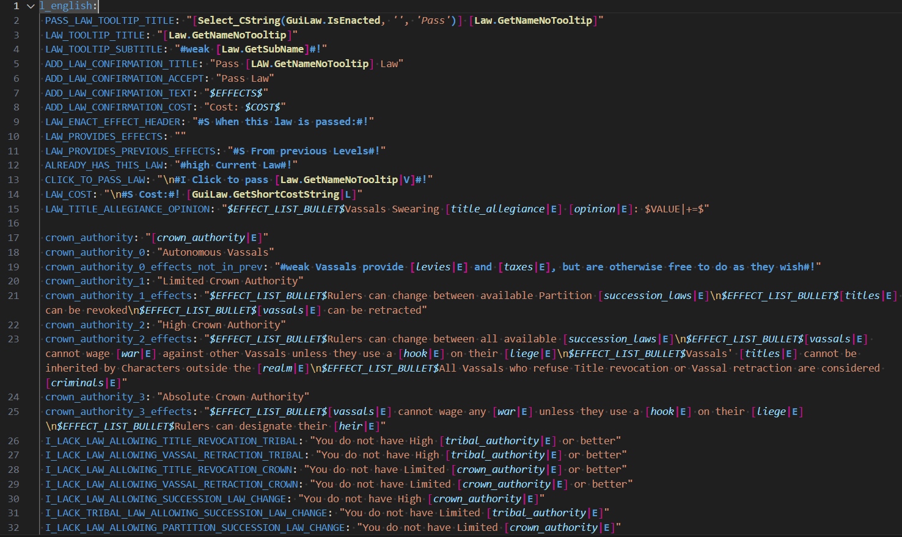

# Paradox Highlight P社文件语法高亮插件

本插件为P社脚本语言提供**语法高亮**和**格式化**功能，主要聚焦`十字军之王3`和`维多利亚3`两款游戏

## 示例

### 事件脚本高亮

### 界面脚本高亮

### 本地化文件高亮

## 特色功能

- 自动高亮P社游戏内置的命令
- 支持多种色彩
- 一键格式化P社脚本
- 支持各类P社文件类型（.txt，.info，.gui和.yml）
- 自动区分`触发器`，`效果`，`修正`，`属性`等不同类型
- 基于`现代深色`二次开发的定制化主题
- 完整支持`十字军之王3`和`维多利亚3`两款游戏的最新版
- 对其它基于`克劳塞维茨`引擎开发的老款P社游戏代码提供基础支持（如`欧陆风云4`，`十字军之王2`和`钢铁雄心4`）

## 使用方式

直接通过[Visual Studio Marketplace](https://marketplace.visualstudio.com/items?itemName=dragon-archer.paradox-highlight)下载最新版

或者，打开`Visual Studio Code`，键入`Ctrl+P`或`Cmd+P`并输入`ext install dragon-archer.paradox-highlight`

你也可以直接用[GitHub](https://github.com/dragon-archer/paradox-highlight)上的源码自己构建

## 更新日志

请看[CHANGELOG.md](CHANGELOG.md)（暂无中文版）

## 待办事项

参见[TODO.md](TODO.md)（暂无中文版）

## 许可证

本项目在MIT许可证下开源

Copyright (C) 2024 dragon-archer
